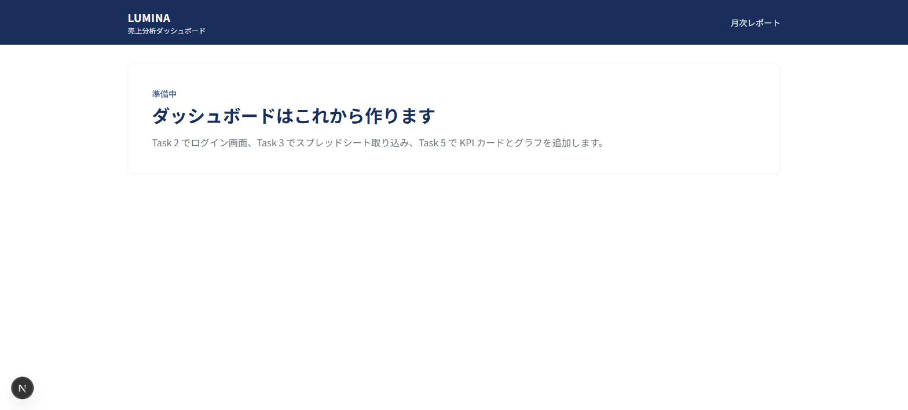
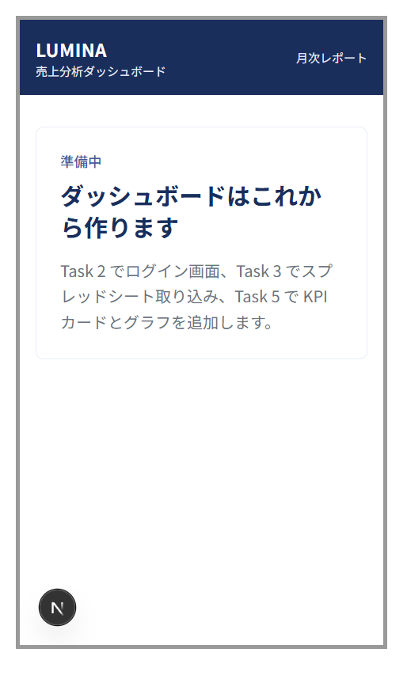

# LUMINA 売上分析ダッシュボード（AI 搭載）

アパレル EC ブランド「LUMINA」のマーケティング担当者向けに、**月次報告の作業時間を 3 時間 → 30 分に短縮**するためのダッシュボードです。
Google スプレッドシートに貼った売上データを読み込み、3 大 KPI（売上・粗利・リピート率）をグラフ化し、OpenAI が「今月のサマリー」と「翌月のアクション提案」をコンサルトーンで生成します。

> このプロジェクトは Claude Code と一緒に、プログラミング初心者が 1 タスクずつ進める形で開発しています。
> 専門用語には（ ）で一言補足を付けています。

## 目次
1. [概要](#1-概要)
2. [画面イメージ](#2-画面イメージ)
3. [技術構成図](#3-技術構成図)
4. [開発の進捗](#4-開発の進捗)
5. [セットアップ手順](#5-セットアップ手順)
6. [スプレッドシートの準備方法](#6-スプレッドシートの準備方法)
7. [KPI の定義](#7-kpi-の定義)
8. [AI 分析の仕組み](#8-ai-分析の仕組み)
9. [開発ルール](#9-開発ルール)
10. [月額コスト試算](#10-月額コスト試算)
11. [Phase 2 ロードマップ](#11-phase-2-ロードマップ)
12. [トラブルシューティング](#12-トラブルシューティング)

---

## 1. 概要

| 項目 | 内容 |
| --- | --- |
| クライアント | アパレル EC「LUMINA」マーケマネージャー |
| 目的 | 月次報告を 3 時間 → 30 分に。社長・マーケ部長・営業 5 名に伝わるレポートにする |
| 絶対 KPI | 売上 / 粗利 / リピート率（+ 前月比） |
| あったら嬉しい | カテゴリ別売上 / SKU トップ 10 / 在庫回転率（Phase 2） |
| 期間軸 | 月次（日次は Phase 2） |
| AI コメント | 現状サマリー + 翌月のアクション提案、コンサルトーン |
| ブランドカラー | 白 + ネイビー `#1A2E5C` |
| データソース | Google スプレッドシート（Shopify から書き出した売上データを貼る） |
| 予算 | 初期 44〜45 万円 / 月額 5,000 円以内 |
| 納期 | 10 営業日（MVP） |

### MVP に含めるもの
1. Google スプレッドシート連携（URL 入力 → 読み込み → Supabase に保存）
2. KPI カード 3 枚（売上 / 粗利 / リピート率）+ 前月比
3. 月次推移グラフ
4. カテゴリ別売上 / SKU トップ 10
5. OpenAI による AI 分析コメント（JSON 構造化出力）
6. ブランドカラー + レスポンシブ対応
7. GitHub Actions による CI（型チェック + Lint + テスト）

## 2. 画面イメージ

Task 1 時点のトップページ（Task 5 でダッシュボードに差し替え）。

| PC | スマホ（375px） |
| --- | --- |
|  |  |

## 3. 技術構成図

```
ユーザー（マーケ担当）
  └─ スプレッドシート URL を入力 / ダッシュボード閲覧
        ▼
Next.js（App Router, TypeScript, Tailwind）on Vercel
  ├─ Google Sheets API でデータ取得（サービスアカウント）
  ├─ Server Action で集計・保存
  └─ Recharts ダッシュボード
        ├─▶ Supabase（PostgreSQL / Auth）
        └─▶ OpenAI API（分析コメント生成）

GitHub → Push → GitHub Actions（型チェック + Lint + テスト）→ Vercel 本番デプロイ
```

| 役割 | 技術 | 一言補足 |
| --- | --- | --- |
| 画面・サーバー | Next.js（App Router）+ TypeScript + Tailwind CSS | React ベースの Web フレームワーク。画面とサーバー処理を 1 つのプロジェクトで書ける |
| グラフ | Recharts | React 用のグラフ部品 |
| DB・ログイン | Supabase（PostgreSQL + Auth + RLS） | 無料枠のある DB サービス。RLS = 行ごとのアクセス制限 |
| AI | OpenAI API（`gpt-4o-mini`） | 安価で JSON 出力が安定しているモデル |
| スプレッドシート | Google Sheets API + サービスアカウント | サービスアカウント = プログラム用の Google アカウント |
| パッケージ管理 | pnpm | npm より高速・省容量 |
| テスト | Vitest | TypeScript 向けの高速テストツール |
| ホスティング / CI | Vercel / GitHub Actions | Push すると自動でテスト・デプロイ |

## 4. 開発の進捗

この表がタスク一覧の唯一の正です（CLAUDE.md からも参照）。worktree 名は `lumina-<名前>`、ブランチは `feature/<名前>`。

| Task | 内容 | worktree 名 | 状態 | 完了日 |
| --- | --- | --- | --- | --- |
| 0 | 開発環境・ルールの整備（CLAUDE.md / hooks / SKILL.md / `.env.example` / README 骨子） | setup | ✅ | 2026-09-12 |
| 1 | Next.js + Tailwind + pnpm の土台、ブランドカラー、`lint` / `type-check`（`tsc --noEmit`）/ `test` スクリプト | scaffold | ✅ | 2026-09-12 |
| 2 | Supabase 接続・DB スキーマ・ログイン画面・RLS | supabase | ⬜ | |
| 3 | Google スプレッドシート取り込み + バリデーション | sheets-import | ⬜ | |
| 4 | KPI 集計ロジック（純粋関数 + ユニットテスト） | kpi | ⬜ | |
| 5 | ダッシュボード UI（KPI カード・グラフ・ランキング） | dashboard-ui | ⬜ | |
| 6 | OpenAI 分析コメント + Snapshot テスト | ai-analysis | ⬜ | |
| 7 | CI/CD（GitHub Actions + Vercel） | ci | ⬜ | |
| 8 | README 仕上げ・納品準備 | release | ⬜ | |

## 5. セットアップ手順

### 5-1. 必要なもの
| 用意するもの | 使う Task | 取得手順の要約 |
| --- | --- | --- |
| Node.js 20 以上 | 0 | https://nodejs.org からインストール（`node -v` で確認） |
| pnpm | 1 | PowerShell で `npm i -g pnpm` → `pnpm -v` で確認 |
| GitHub リポジトリ | 0 | github.com → New repository → Private → README 無しで作成 |
| Supabase プロジェクト | 2 | supabase.com → New project（リージョン Tokyo、Free）→ Settings → API で `Project URL` / `anon key` / `service_role key` を控える |
| OpenAI API キー | 6 | platform.openai.com → API keys → Create new secret key。Billing で $5 程度チャージ |
| Google Cloud サービスアカウント | 3 | 手順は `.claude/skills/google-sheets-import/SKILL.md` 参照。JSON の `client_email` と `private_key` を使う |

### 5-2. 手順
```powershell
git clone https://github.com/atsusagi111-dot/lumina-dashboard.git
cd lumina-dashboard
pnpm install                        # 依存パッケージを入れる（初回は数分）
Copy-Item .env.example .env.local   # 値を埋める（Task 2 以降で必要）
pnpm dev                            # http://localhost:3000 を開く
```

主な構成：Next.js 16（App Router）/ React 19 / Tailwind CSS 4 / Recharts 3 / Vitest 5 / TypeScript 5。

### 5-3. コマンド一覧
| コマンド | 内容 |
| --- | --- |
| `pnpm dev` | 開発サーバー起動（ファイルを保存すると自動で画面が更新される） |
| `pnpm build` | 本番用ビルド。Vercel が実行するものと同じ |
| `pnpm lint` | ESLint |
| `pnpm type-check` | TypeScript の型チェック |
| `pnpm test` | ユニットテスト（Vitest。`tests/**/*.test.ts(x)` を実行） |
| `pnpm test:analysis` | AI 分析の Snapshot テスト（Task 6 で追加。OpenAI を実際に呼ぶ） |

## 6. スプレッドシートの準備方法

この節がスプレッドシートの列仕様と共有手順の唯一の正です（詳しい手順は Task 3 で追記）。
1. 1 行目はヘッダー。列は次の 8 列をこの順・この名前で：
   `order_date, customer_id, product_name, category, sku, quantity, revenue, cost`
   - `order_date` は `YYYY-MM-DD`、`quantity` は 1 以上の整数、`revenue` / `cost` は円（整数）
   - `customer_id` は空でも可（匿名購入。リピート率の計算からは除外）
2. 「共有」からサービスアカウントのメールアドレスを **閲覧者** として追加
3. スプレッドシートの URL をダッシュボードに貼る

サンプルデータと集計の正解値は [docs/sample-data.md](docs/sample-data.md) を参照。

## 7. KPI の定義

算出する KPI：売上 / 粗利 / 粗利率 / リピート率（月次・全期間）/ 前月比 / カテゴリ別売上 / SKU トップ 10。
定義と計算式は `.claude/skills/kpi-calculation/SKILL.md`、サンプルデータでの正解値は [docs/sample-data.md](docs/sample-data.md) を参照（いずれも唯一の正。ここには複製しない）。

## 8. AI 分析の仕組み

- 生データではなく **集計結果だけ** を OpenAI に渡す（トークン節約・精度向上・個人情報を出さない）
- 出力は JSON（`summary` / `highlights` / `concerns` / `actions`）に固定し、Zod で検証。失敗時は最大 2 回リトライ
- プロンプトの型と Snapshot テストは `.claude/skills/openai-analysis/SKILL.md` を参照
- コストは [§10 月額コスト試算](#10-月額コスト試算) を参照

## 9. 開発ルール

詳細は [CLAUDE.md](CLAUDE.md)。ここでは仕組みの説明だけまとめます。

### 開発サイクル（1 タスクごと）
```
プランモードで計画 → 承認 → worktree 作成 → 実装 → /code-review → /simplify
→ 指摘の反映 → テスト → README 更新 → コミット → main へマージ → worktree 削除
```

### 用語
| 用語 | 何か | なぜ使うか |
| --- | --- | --- |
| プランモード | Claude がファイルを変更せず「何をどう作るか」だけ提示するモード | 承認前にコードが書かれるのを防ぐ |
| ブランチ | 作業履歴の枝分かれ。`main` が本線、`feature/xxx` が作業用 | 本線を壊さずに試せる |
| git worktree | 1 つのリポジトリから別フォルダにブランチを展開する機能 | 「タスク = フォルダ」で管理でき、切替の混乱がない |
| hooks | Claude Code が特定のタイミングで自動実行する小さなプログラム | lint やレビュー忘れの警告を機械にやらせる |
| CLAUDE.md | プロジェクトの約束事。Claude が毎回自動で読む | ルールをセッションをまたいで守らせる |
| SKILL.md | 特定作業の手順書（`.claude/skills/<名前>/SKILL.md`） | 毎回説明し直さずに再現できる |
| slash command | `.claude/commands/xxx.md` を `/xxx` で呼び出す | レビュー観点を固定できる |

### hooks の内容（`.claude/settings.json`）
| タイミング | スクリプト | 動作 |
| --- | --- | --- |
| PostToolUse（Claude がファイルを編集・作成した直後） | `.claude/hooks/lint-check.mjs` | 編集した TS/JS ファイル 1 つに ESLint をかけ、エラーがあれば Claude に知らせる |
| Stop（Claude が返答を終えた瞬間） | `.claude/hooks/stop-check.mjs` | プロジェクト全体の型チェックを 1 回実行し、エラーがあれば返答を終える前に直させる。あわせて「/code-review と /simplify を実行済みか」を表示する |

動作の詳しい条件（対象拡張子、`package.json` が無いときの挙動など）は各スクリプト冒頭のコメントが唯一の正。共通処理は `.claude/hooks/lib.mjs`。

worktree の作成・片付けコマンドは [CLAUDE.md §1](CLAUDE.md) を参照。

### ディレクトリ構成（現在）
```
app/                  画面（App Router）。layout.tsx = 共通の枠、page.tsx = トップページ、globals.css = ブランドカラー
components/           UI 部品（site-header.tsx など）
tests/                テスト。setup.ts（共通準備）、smoke.test.tsx（動作確認）、fixtures/sample-sales.csv
docs/                 補足ドキュメント（正解値、画面イメージ）
.claude/              commands（/code-review, /simplify）、hooks、skills、settings.json
CLAUDE.md             開発ルール（末尾の nextjs-agent-rules ブロックは Next.js が自動で追記するもの）
.env.example          環境変数のキー名一覧
package.json          依存パッケージと pnpm スクリプト
tsconfig.json         TypeScript 設定（@/ = プロジェクトルート）
eslint.config.mjs     ESLint 設定（Next.js 推奨ルール）
vitest.config.mts     Vitest 設定
next.config.ts        Next.js 設定
postcss.config.mjs    Tailwind 4 を CSS に組み込む設定
pnpm-workspace.yaml   インストール時スクリプトの許可設定（pnpm の安全機能）
```

### ブランドカラーの使い方
Tailwind 4 は設定ファイル（`tailwind.config.ts`）を使わず、`app/globals.css` の `@theme` に色を書きます。
登録済み：`navy`（#1A2E5C）/ `navy-light` / `navy-pale` / `ink` / `ink-muted` / `up`（上昇）/ `down`（下降）。
`bg-navy` `text-navy-light` のようにクラス名で使えます。グラフ（Recharts）でも `fill="var(--color-navy)"` のように同じ変数を渡せるので、色の定義は `globals.css` の 1 箇所だけです。

## 10. 月額コスト試算

Task 8 で確定。目安：Vercel Hobby（0 円）+ Supabase Free（0 円）+ OpenAI（月 100 回で約 10 円）= **5,000 円以内**。

## 11. Phase 2 ロードマップ

- Shopify API 直接連携（日次自動更新）
- 異常検知アラート（前月比 ±20% で Slack 通知）
- PDF レポート自動生成 + メール配信
- 多店舗 / 多チャネル対応（Amazon / 楽天など）
- 在庫回転率（在庫データの取り込みが必要）

## 12. トラブルシューティング

| 症状 | 原因と対処 |
| --- | --- |
| `pnpm` が見つからない | `npm i -g pnpm` を実行し、PowerShell を開き直す |
| `pnpm install` 後に `npm warn allow-scripts` と出る | 警告であってエラーではない。無視してよい |
| `tailwind.config.ts` が見つからない | Tailwind 4 には無い。色は `app/globals.css` の `@theme` に書く |
| `next dev` を実行すると CLAUDE.md に英語のブロックが追記される | Next.js 16 の機能（AI 向けの注意書き）。そのままコミットしてよい |
| 型エラー `Cannot find name 'LayoutProps'` | Next.js がビルド時に生成する型。CI では無いので `{ children: React.ReactNode }` と明示する |
| `.claude/settings.json` を変えたのに hooks が動かない | hooks は Claude Code の起動時に読み込まれる。Claude Code を再起動する |
| git で `CRLF will be replaced by LF` と警告が出る | Windows の改行コード（CRLF）を `.gitattributes` の設定で LF に統一するときの通知。無視してよい。逆に `LF will be replaced by CRLF` と出たら `.gitattributes` が効いていないので確認する |
| hooks が「pnpm が見つかりません」と言う | `npm i -g pnpm` を実行し、Claude Code を再起動する |
| hooks が動かない | `node -v` で Node が入っているか確認。`.claude/settings.json` の JSON が壊れていないか `node -e "JSON.parse(require('fs').readFileSync('.claude/settings.json','utf8'))"` で確認 |
