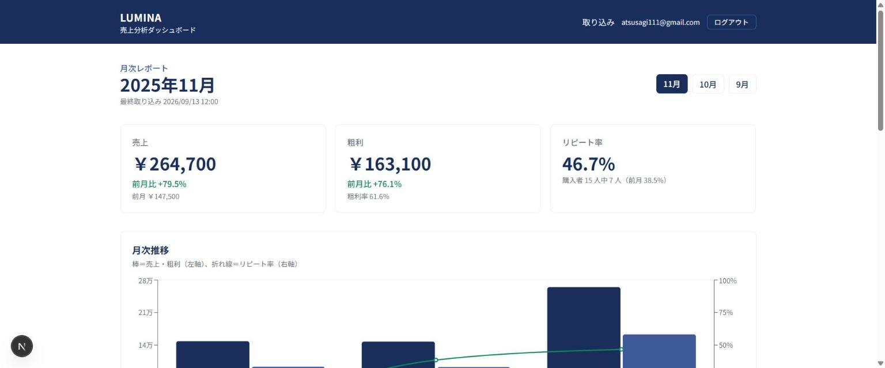
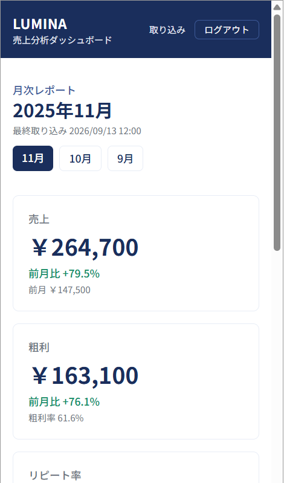
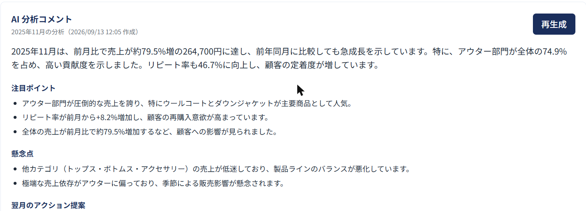

# LUMINA 売上分析ダッシュボード（AI 搭載）

[](https://github.com/atsusagi111-dot/lumina-dashboard/actions/workflows/ci.yml)

アパレル EC ブランド「LUMINA」のマーケティング担当者向けに、**月次報告の作業時間を 3 時間 → 30 分に短縮**するためのダッシュボードです。
Google スプレッドシートに貼った売上データを読み込み、3 大 KPI（売上・粗利・リピート率）をグラフ化し、OpenAI が「今月のサマリー」と「翌月のアクション提案」をコンサルトーンで生成します。

> このプロジェクトは Claude Code と一緒に、プログラミング初心者が 1 タスクずつ進める形で開発しています。
> 専門用語には（ ）で一言補足を付けています。

## 目次
1. [概要](#1-概要)
2. [画面イメージ](#2-画面イメージ)
3. [技術構成図](#3-技術構成図)
4. [開発の進捗](#4-開発の進捗)
5. [セットアップ手順](#5-セットアップ手順)
6. [スプレッドシートの準備方法](#6-スプレッドシートの準備方法)
7. [KPI の定義](#7-kpi-の定義)
8. [AI 分析の仕組み](#8-ai-分析の仕組み)
9. [開発ルール](#9-開発ルール)
10. [月額コスト試算](#10-月額コスト試算)
11. [Phase 2 ロードマップ](#11-phase-2-ロードマップ)
12. [トラブルシューティング](#12-トラブルシューティング)

---

## 1. 概要

| 項目 | 内容 |
| --- | --- |
| クライアント | アパレル EC「LUMINA」マーケマネージャー |
| 目的 | 月次報告を 3 時間 → 30 分に。社長・マーケ部長・営業 5 名に伝わるレポートにする |
| 絶対 KPI | 売上 / 粗利 / リピート率（+ 前月比） |
| あったら嬉しい | カテゴリ別売上 / SKU トップ 10 / 在庫回転率（Phase 2） |
| 期間軸 | 月次（日次は Phase 2） |
| AI コメント | 現状サマリー + 翌月のアクション提案、コンサルトーン |
| ブランドカラー | 白 + ネイビー `#1A2E5C` |
| データソース | Google スプレッドシート（Shopify から書き出した売上データを貼る） |
| 予算 | 初期 44〜45 万円 / 月額 5,000 円以内 |
| 納期 | 10 営業日（MVP） |

### MVP に含めるもの
1. Google スプレッドシート連携（URL 入力 → 読み込み → Supabase に保存）
2. KPI カード 3 枚（売上 / 粗利 / リピート率）+ 前月比
3. 月次推移グラフ
4. カテゴリ別売上 / SKU トップ 10
5. OpenAI による AI 分析コメント（JSON 構造化出力）
6. ブランドカラー + レスポンシブ対応
7. GitHub Actions による CI（型チェック + Lint + テスト + 本番ビルド）

## 2. 画面イメージ

| ダッシュボード（PC） | ダッシュボード（スマホ 375px） |
| --- | --- |
|  |  |

AI 分析コメント（生成後）:



スマホ幅の確認方法：ブラウザの開発者ツール（F12）→ 端末ツールバー（Ctrl + Shift + M）→ 幅を 375px にする。
横スクロールが出ないこと、KPI カードが縦に並ぶこと、グラフの目盛りが読めることを確認します。

## 3. 技術構成図

```
ユーザー（マーケ担当）
  └─ スプレッドシート URL を入力 / ダッシュボード閲覧
        ▼
Next.js（App Router, TypeScript, Tailwind）on Vercel
  ├─ Google Sheets API でデータ取得（サービスアカウント）
  ├─ Server Action で集計・保存
  └─ Recharts ダッシュボード
        ├─▶ Supabase（PostgreSQL / Auth）
        └─▶ OpenAI API（分析コメント生成）

GitHub → Push → GitHub Actions（型チェック + Lint + テスト + 本番ビルド）→ Vercel 本番デプロイ
```

| 役割 | 技術 | 一言補足 |
| --- | --- | --- |
| 画面・サーバー | Next.js（App Router）+ TypeScript + Tailwind CSS | React ベースの Web フレームワーク。画面とサーバー処理を 1 つのプロジェクトで書ける |
| グラフ | Recharts | React 用のグラフ部品 |
| DB・ログイン | Supabase（PostgreSQL + Auth + RLS） | 無料枠のある DB サービス。RLS = 行ごとのアクセス制限 |
| AI | OpenAI API（`gpt-4o-mini`） | 安価で JSON 出力が安定しているモデル |
| スプレッドシート | Google Sheets API + サービスアカウント | サービスアカウント = プログラム用の Google アカウント |
| パッケージ管理 | pnpm | npm より高速・省容量 |
| テスト | Vitest | TypeScript 向けの高速テストツール |
| ホスティング / CI | Vercel / GitHub Actions | Push すると自動でテスト・デプロイ |

## 4. 開発の進捗

この表がタスク一覧の唯一の正です（CLAUDE.md からも参照）。worktree 名は `lumina-<名前>`、ブランチは `feature/<名前>`。

| Task | 内容 | worktree 名 | 状態 | 完了日 |
| --- | --- | --- | --- | --- |
| 0 | 開発環境・ルールの整備（CLAUDE.md / hooks / SKILL.md / `.env.example` / README 骨子） | setup | ✅ | 2026-09-12 |
| 1 | Next.js + Tailwind + pnpm の土台、ブランドカラー、`lint` / `type-check`（`tsc --noEmit`）/ `test` スクリプト | scaffold | ✅ | 2026-09-12 |
| 2 | Supabase 接続・DB スキーマ・ログイン画面・RLS | supabase | ✅ | 2026-09-12 |
| 3 | Google スプレッドシート取り込み + バリデーション | sheets-import | ✅ | 2026-09-12 |
| 4 | KPI 集計ロジック（純粋関数 + ユニットテスト） | kpi | ✅ | 2026-09-12 |
| 5 | ダッシュボード UI（KPI カード・グラフ・ランキング） | dashboard-ui | ✅ | 2026-09-13 |
| 6 | OpenAI 分析コメント + Snapshot テスト | ai-analysis | ✅ | 2026-09-13 |
| 7 | CI/CD（GitHub Actions + Vercel） | ci | ✅ | 2026-09-13 |
| 8 | README 仕上げ・納品準備 | release | ⬜ | |

## 5. セットアップ手順

### 5-1. 必要なもの
| 用意するもの | 使う Task | 取得手順の要約 |
| --- | --- | --- |
| Node.js 20 以上 | 0 | https://nodejs.org からインストール（`node -v` で確認） |
| pnpm | 1 | PowerShell で `npm i -g pnpm` → `pnpm -v` で確認 |
| GitHub リポジトリ | 0 | github.com → New repository → Private → README 無しで作成 |
| Supabase プロジェクト | 2 | 手順は [§5-4](#5-4-supabase-の準備) を参照 |
| OpenAI API キー | 6 | platform.openai.com → API keys → Create new secret key。Billing で $5 程度チャージ |
| Google Cloud サービスアカウント | 3 | 手順は `.claude/skills/google-sheets-import/SKILL.md` 参照。JSON の `client_email` と `private_key` を使う |

### 5-2. 手順
```powershell
git clone https://github.com/atsusagi111-dot/lumina-dashboard.git
cd lumina-dashboard
pnpm install                        # 依存パッケージを入れる（初回は数分）
Copy-Item .env.example .env.local   # 値を埋める（Task 2 以降で必要）
pnpm dev                            # http://localhost:3000 を開く
```

使用技術は CLAUDE.md §2、実際のバージョンは `package.json` を参照してください。グラフ用の Recharts は Task 5 から使い始めます。

### 5-3. コマンド一覧
| コマンド | 内容 |
| --- | --- |
| `pnpm dev` | 開発サーバー起動（ファイルを保存すると自動で画面が更新される） |
| `pnpm build` | 本番用ビルド。Vercel が実行するものと同じ |
| `pnpm start` | ビルド結果を本番と同じ形で起動して確認する |
| `pnpm lint` | ESLint |
| `pnpm type-check` | TypeScript の型チェック |
| `pnpm test` | ユニットテスト（Vitest。`tests/**/*.test.ts(x)` を実行） |
| `pnpm test:analysis` | AI 分析の Snapshot テスト。**実際に OpenAI を呼ぶ**ので 1 回あたり 1 円未満の費用がかかる。プロンプトを変えたときだけ実行する（`pnpm test` には含まれない） |

### 5-4. Supabase の準備

初回だけ必要な作業です。画面の指示どおりに進めれば 10 分ほどで終わります。

**① プロジェクトを作る**
1. https://supabase.com にサインイン →「New project」
2. 名前は `lumina`、リージョンは **Northeast Asia (Tokyo)**、プランは Free
3. データベースのパスワードは自動生成のものを控えておく（後で使う場面は少ないが再発行が面倒）
4. 作成完了まで数分待つ

**② 鍵を .env.local に書く**
1. 左メニュー **Settings → API Keys** を開く
2. 次の 3 つをコピーする
   - Project URL
   - publishable key（`sb_publishable_...` で始まる。ブラウザに出てよい鍵）
   - secret key（`sb_secret_...` で始まる。**絶対に公開しない鍵**。使い始めるのは Task 6 以降なので、今は空でも動きます）
3. プロジェクト直下で `Copy-Item .env.example .env.local` を実行し、3 つを貼り付ける
4. 開発サーバーを起動していたら再起動する（`.env.local` は起動時に読まれるため）

> 旧名の `anon key` / `service_role key` も同じ画面にありますが、2026 年末に廃止予定です。新しい publishable / secret を使ってください。

**③ テーブルを作る**
1. 左メニュー **SQL Editor** →「New query」
2. `supabase/migrations/0001_init.sql` の中身を全部貼り付けて **Run**
3. 同じ手順で `supabase/migrations/0002_rls.sql` も **Run**
4. 左メニュー **Table Editor** に `uploads` / `sales_data` / `reports` の 3 つが出ていれば成功

#### マイグレーション（DB の設計変更）の運用方針

このプロジェクトのルールです。迷ったらここを見てください。

- `0001_init.sql` は常に「**あるべき最新のスキーマ**」を表します。設計を変えたら、このファイルも最新形に書き換えます。
- **まっさらな Supabase プロジェクト** に入れるときは、`0001` → `0002` の 2 つだけを Run します。
- **すでにテーブルを作ってある** データベースには、差分ファイル（`0003` 以降）を Run して追いつかせます。
  `create table if not exists` は既存のテーブルに列や制約を足さないため、差分ファイルが必要です。
- どの差分をどこまで当てたかは、この節に追記して管理します。

| 差分ファイル | 内容 | 誰が Run する必要があるか |
| --- | --- | --- |
| `0003_constraints.sql` | 数量・金額のマイナス禁止、レポートの重複防止、索引の見直し | 2026-09-12 より前に `0001` を Run した人 |
| `0004_reports_month.sql` | AI 分析レポートを「取り込み × 月」で持てるようにする（`target_month` 列の追加） | 2026-09-13 より前に `0001` を Run した人 |

**④ 利用者のアカウントを作る（招待制）**

このダッシュボードには新規登録フォームがありません。売上データを扱うため、アカウントは管理者が発行します。

1. 左メニュー **Authentication → Users** →「Add user」→「Create new user」
2. メールアドレスとパスワードを入力
3. **Auto Confirm User にチェック**（確認メールを省略してすぐ使えるようになる）
4. 社長・マーケ部長・営業 5 名の分も、同じ手順で追加する

### 5-5. ログインとデータの守り方

#### ログイン
- **招待制**です。新規登録フォームは置かず、アカウントは Supabase の管理画面から発行します（[§5-4 ④](#5-4-supabase-の準備)）。
- 未ログインの人がどのページを開いても `/login` に転送されます。判定はページ表示前に走る `proxy.ts` が行います。
- Next.js 16 から、この仕組みのファイル名が `middleware.ts` → `proxy.ts` に変わりました。

#### RLS（行ごとのアクセス制限）とは
テーブルの「行」単位で、誰が読み書きできるかを **データベース自身に守らせる**仕組みです。

アプリのコードに「他人のデータは出さない」と書く方法もありますが、1 箇所書き忘れれば漏れます。
RLS はその内側にあるもう 1 枚の壁で、アプリにバグがあってもデータベースが他人の行を返しません。

このプロジェクトでの設定（`supabase/migrations/0002_rls.sql`）：

| テーブル | 見える範囲 |
| --- | --- |
| `uploads` | 自分が取り込んだ記録だけ |
| `sales_data` | 自分の取り込みに紐づく売上明細だけ |
| `reports` | 自分の取り込みに紐づく AI レポートだけ |

「自分」は `auth.uid()`（今ログインしている人の ID）で判定します。

#### 鍵の使い分け
| 鍵 | 置き場所 | 役割 |
| --- | --- | --- |
| publishable key | ブラウザに出てよい | 読み書きの範囲は RLS が制限する |
| secret key | サーバーのみ | **RLS を無視できる**ので、絶対に公開しない。`NEXT_PUBLIC_` を付けない |

### 5-6. Vercel へのデプロイ（インターネットに公開する）

手元の `pnpm dev` は自分のパソコンでしか開けません。クライアントに URL を渡すには Vercel に載せます。

**① プロジェクトを作る（最初の 1 回だけ）**
1. https://vercel.com に **GitHub アカウントで** サインイン
2. 「Add New…」→「Project」→ `atsusagi111-dot/lumina-dashboard` を **Import**
3. Framework は Next.js が自動で選ばれます。そのままで構いません

**② 環境変数を登録する（ここが一番大事）**

`.env.local` に書いた値と同じものを、Vercel の **Environment Variables** に登録します。
`.env.local` はコミットされないため、登録しないとログインも取り込みも動きません。

- 登録するキーの一覧と意味は **`.env.example`** を見てください（キーの唯一の正はこのファイルです）。
- **Environment は Production / Preview / Development の 3 つともチェック**を入れてください。
  Preview に入れ忘れると、本番は動くのにプレビュー用の URL だけが落ちて原因が分かりにくくなります。
- `GOOGLE_PRIVATE_KEY` だけ貼り方に注意：`\n` を含む 1 行のまま貼り、**前後のダブルクォートは付けません**
  （`.env.local` ではクォートで囲みますが、Vercel の入力欄では不要です）。

**③ Deploy を押す**

数分で URL（`https://<プロジェクト名>.vercel.app`）が発行されます。

**④ 以降は自動**

`main` に push するたびに、Vercel が自動でビルドして本番を更新します。

> **環境変数を後から足したり直したりしたときは、再デプロイが必要です。**
> Vercel の Deployments 画面 → 最新のデプロイの「…」→ Redeploy を押してください。

## 6. スプレッドシートの準備方法

この節がスプレッドシートの列仕様と共有手順の唯一の正です。クライアントにはこの節を案内してください。

### ① 列を用意する
1 行目はヘッダー。次の 8 列を **この順・この名前** で並べます。

| 列名 | 必須 | 中身 | 受け付ける書き方 |
| --- | --- | --- | --- |
| `order_date` | 必須 | 注文日 | `2025-11-03` / `2025/11/3` |
| `customer_id` | 任意 | 顧客 ID | 空なら匿名購入としてリピート率の計算から除外 |
| `product_name` | 必須 | 商品名 | |
| `category` | 任意 | カテゴリ | |
| `sku` | 任意 | 品番 | |
| `quantity` | 必須 | 数量 | 1 以上の整数 |
| `revenue` | 必須 | 売上（円） | `19800` / `19,800` / `¥19,800` |
| `cost` | 必須 | 原価（円） | 同上 |

- 完全に空の行は自動で飛ばします。
- **1 行でも問題があれば、何も保存せずに「何行目の何がおかしいか」を表示します。** 一部だけ保存すると月次の合計が静かにずれるためです。

### ② サービスアカウントに共有する
スプレッドシート右上の「共有」から、`.env.local` の `GOOGLE_SERVICE_ACCOUNT_EMAIL` に設定したアドレスを **閲覧者** として追加します。
このアドレスは取り込み画面にも表示されるので、そこからコピーできます。

### ③ 取り込む
ログインして「取り込み」画面を開き、スプレッドシートの URL を貼って「取り込む」を押します。
URL ではなくシート ID を直接貼っても構いません。読み込むのは 1 枚目のシートの A〜H 列です。

同じシートを何度取り込んでも構いません。そのたびに新しい取り込み記録として追加され、履歴が残ります。

**ダッシュボードが集計するのは、いちばん新しい取り込み 1 件だけです。** 取り込み直しても売上が二重に数えられることはありません。
そのかわり、シートには **全期間の売上を貯めておいてください**（毎月その月の分だけを貼り替えて取り込むと、過去の月がダッシュボードから消えます）。

サンプルデータと集計の正解値は [docs/sample-data.md](docs/sample-data.md) を参照。

## 7. KPI の定義

算出する KPI：売上 / 粗利 / 粗利率 / リピート率（月次・全期間）/ 前月比 / カテゴリ別売上 / SKU トップ 10。
定義と計算式は `.claude/skills/kpi-calculation/SKILL.md`、サンプルデータでの正解値は [docs/sample-data.md](docs/sample-data.md) を参照（いずれも唯一の正。ここには複製しない）。

計算は `lib/kpi/` の **純粋関数**（入力だけで出力が決まり、データベースにも API にも触らない関数）で行います。
画面はこの関数が返した数字を並べるだけなので、Excel との突き合わせは関数のテストだけで済みます。

どの関数を呼べばよいかの地図：

| 関数 | 役割 |
| --- | --- |
| `calcMonthlyKpis(rows)` | 月次 KPI の一式 |
| `calcCategoryBreakdown(rows, { month })` | カテゴリ別の売上と構成比 |
| `calcTopSkus(rows, { month, limit })` | SKU ランキング |
| `calcOverallRepeatRate(rows)` | 全期間のリピート率 |

端数・`null`・並び順の規則は `.claude/skills/kpi-calculation/SKILL.md` の「端数と境界の扱い」を参照してください。

### 画面での見せ方（Task 5）
- 表示する月は画面右上のボタンで切り替えます。URL（`/?month=2025-10`）に入るので、その月の画面をそのまま共有できます。
- 既定では **いちばん新しい月** を開きます。データの無い月を URL で指定された場合も、最新月に戻します。
- 「計算できない」ものは `0` ではなく **—** と表示します（前月のデータが無い月の前月比など）。
- グラフは Recharts。棒＝売上・粗利（左軸）、折れ線＝リピート率（右軸）。カテゴリ別は横棒（日本語のカテゴリ名が読みやすいため）。
- 数字の整形（`￥264,700` / `46.7%` / `+79.5%` と色分け）は `lib/dashboard/format.ts` に集約しています。

## 8. AI 分析の仕組み

### 何が出るか
ダッシュボードの「AI 分析コメント」欄に、対象月の **サマリー / 注目ポイント / 懸念点 / 翌月のアクション提案**（優先度つき）が出ます。文体はコンサルトーンです。

### いつ生成されるか
**「AI 分析を生成」ボタンを押したときだけ** です。画面を開くだけでは呼び出しません（OpenAI は呼ぶたびに課金されるため）。
一度作った月はデータベース（`reports` テーブル）に保存され、次からは保存済みのものが表示されます。作り直したいときは「再生成」を押します。

### 仕組み
- 生データではなく **集計結果だけ** を渡す（トークン節約・精度向上・`customer_id` を外部に出さない）。渡す形は `lib/analysis/build-input.ts`、渡していないことはテストで検証しています
- 渡すのは対象月を含む **直近 3 か月** の KPI、対象月のカテゴリ別売上、SKU トップ 10
- 出力は JSON（`summary` / `highlights` / `concerns` / `actions`）に固定（Structured Outputs）し、Zod でも検証。形が違えば **最大 3 回**まで作り直し、それでもだめなら画面にエラーを出して保存しない
- モデルは `.env.example` の `OPENAI_MODEL`（既定 `gpt-4o-mini`）
- プロンプトの文言と Snapshot テストの方針は `.claude/skills/openai-analysis/SKILL.md` が唯一の正
- 実際の生成例は [tests/analysis/__snapshots__/latest-report.json](tests/analysis/__snapshots__/latest-report.json)
- コストは [§10 月額コスト試算](#10-月額コスト試算) を参照

## 9. 開発ルール

詳細は [CLAUDE.md](CLAUDE.md)。ここでは仕組みの説明だけまとめます。

### 開発サイクル（1 タスクごと）
```
プランモードで計画 → 承認 → worktree 作成 → 実装 → /code-review → /simplify
→ 指摘の反映 → テスト → README 更新 → コミット → main へマージ → worktree 削除
```

### 用語
| 用語 | 何か | なぜ使うか |
| --- | --- | --- |
| プランモード | Claude がファイルを変更せず「何をどう作るか」だけ提示するモード | 承認前にコードが書かれるのを防ぐ |
| ブランチ | 作業履歴の枝分かれ。`main` が本線、`feature/xxx` が作業用 | 本線を壊さずに試せる |
| git worktree | 1 つのリポジトリから別フォルダにブランチを展開する機能 | 「タスク = フォルダ」で管理でき、切替の混乱がない |
| hooks | Claude Code が特定のタイミングで自動実行する小さなプログラム | lint やレビュー忘れの警告を機械にやらせる |
| CLAUDE.md | プロジェクトの約束事。Claude が毎回自動で読む | ルールをセッションをまたいで守らせる |
| SKILL.md | 特定作業の手順書（`.claude/skills/<名前>/SKILL.md`） | 毎回説明し直さずに再現できる |
| slash command | `.claude/commands/xxx.md` を `/xxx` で呼び出す | レビュー観点を固定できる |

### hooks の内容（`.claude/settings.json`）
| タイミング | スクリプト | 動作 |
| --- | --- | --- |
| PostToolUse（Claude がファイルを編集・作成した直後） | `.claude/hooks/lint-check.mjs` | 編集した TS/JS ファイル 1 つに ESLint をかけ、エラーがあれば Claude に知らせる |
| Stop（Claude が返答を終えた瞬間） | `.claude/hooks/stop-check.mjs` | プロジェクト全体の型チェックを 1 回実行し、エラーがあれば返答を終える前に直させる。あわせて「/code-review と /simplify を実行済みか」を表示する |

動作の詳しい条件（対象拡張子、`package.json` が無いときの挙動など）は各スクリプト冒頭のコメントが唯一の正。共通処理は `.claude/hooks/lib.mjs`。

worktree の作成・片付けコマンドは [CLAUDE.md §1](CLAUDE.md) を参照。

### CI（GitHub Actions）— push したら自動で検査

`.github/workflows/ci.yml` に書いてあります。**`main` と `feature/**` への push、および Pull Request のとき**に、
GitHub のパソコンが手元と同じ検査を順に流します。
作業中のブランチでも走らせるのは、この案件が Pull Request を作らず手元で main に merge する進め方のため、
main に入ってから気づくのでは手遅れだからです。

| 順番 | 内容 | 落ちたときの意味 |
| --- | --- | --- |
| 1 | `pnpm install --frozen-lockfile` | `package.json` を変えたのに `pnpm-lock.yaml` を更新していない |
| 2 | `pnpm lint` | 書き方の問題。手元で `pnpm lint` を実行すると同じ内容が出る |
| 3 | `pnpm type-check` | 型が合っていない |
| 4 | `pnpm test` | テストが失敗。壊した箇所が分かる |
| 5 | `pnpm build` | 本番ビルドが通らない（画面の組み立てで失敗） |

- 結果は GitHub の **Actions** タブと、README 冒頭のバッジ（緑／赤）で分かります。
- ビルドには**ダミーの環境変数**を渡しています。本物の鍵は Vercel 側にだけ登録します（[§5-6](#5-6-vercel-へのデプロイインターネットに公開する)）。
- `pnpm test:analysis`（OpenAI を実際に呼ぶテスト）は **CI では実行しません**。呼ぶたびに課金されるためです。
- 料金は [§10 月額コスト試算](#10-月額コスト試算) を参照。

### ディレクトリ構成（現在）
```
app/                  画面（App Router）。layout.tsx = 共通の枠、page.tsx = トップページ、globals.css = ブランドカラー
app/login/            ログイン画面と Server Action（ログイン・ログアウト）
app/import/           取り込み画面と Server Action（読み込み・検査・保存）
lib/sheets/           スプレッドシートの ID 取り出し・読み込み・検査
lib/kpi/              KPI 集計の純粋関数（monthly = 月次、breakdown = カテゴリと SKU、round = 端数処理）
lib/dashboard/        画面用の準備（load-sales-rows = DB からの読み出し、format = 表示の整形、select-month = 表示する月の決定）
lib/analysis/         AI 分析（build-input = 渡すデータの組み立て、prompt = 指示文、generate-report = OpenAI 呼び出し、report-schema = 出力の形）
lib/sales-row.ts      売上 1 行の型（取り込み側と集計側の共通）
lib/env.ts            環境変数の読み込み。未設定なら日本語で案内して止める
lib/auth/             ログインが要るかの判定、エラー文の日本語化
lib/supabase/         Supabase 接続（client = ブラウザ用、server = サーバー用、proxy = ログイン判定、require-user = 認可チェック）
proxy.ts              全ページの表示前に走る入口（Next.js 16 で middleware.ts から改名）
supabase/migrations/  DB のテーブル定義と RLS 設定の SQL
public/               画像などそのまま配信するファイル
components/           UI 部品（site-header.tsx など）
components/dashboard/ ダッシュボードの部品（KPI カード・月切り替え・グラフ 2 種・SKU 表）
tests/                テスト一式。fixtures/sample-sales.csv（テストで使う売上データ）
case8-sales-sample.csv 受領時の原本。内容は fixtures と同じで、こちらは変更しない
docs/                 補足ドキュメント（正解値、画面イメージ）
.github/workflows/    CI の設定（push したときに自動で走る検査）
.nvmrc                使う Node.js のバージョン（手元・CI・Vercel を揃えるため）
.claude/              commands（/code-review, /simplify）、hooks、skills、settings.json
CLAUDE.md             開発ルール
.env.example          環境変数のキー名一覧
各種設定             package.json / tsconfig.json / eslint.config.mjs / vitest.config.mts /
                     next.config.ts / postcss.config.mjs / pnpm-workspace.yaml
```

### ブランドカラーの使い方
色の定義と使い方（クラス名・グラフからの参照方法）は `app/globals.css` の `@theme` とそのコメントが唯一の正です。
Tailwind 4 には `tailwind.config.ts` がなく、色は CSS に直接書きます。

## 10. 月額コスト試算

Task 8 で確定。目安：Vercel Hobby（0 円）+ Supabase Free（0 円）+ GitHub Actions（0 円）+ OpenAI（月 100 回で約 10 円）= **約 10 円**。

> **Vercel Hobby は「非商用・個人利用のみ」**（[Vercel の規約](https://vercel.com/docs/limits/fair-use-guidelines#commercial-usage)）。
> このプロジェクトは**デモ用途のため Hobby を使っています**。クライアントが実際の業務で使い始める段階では
> **Pro（$20/月・約 3,000 円）への切り替えが必要**です。その場合でも合計は約 3,010 円で、予算の 5,000 円以内に収まります。

GitHub Actions は Private リポジトリでも月 2,000 分無料（Public なら無制限。超過分は Linux ランナーで 1 分 $0.006）。
1 回の検査が 3〜5 分なので、月 20 回 push しても 100 分程度です。

### AI 分析 1 回あたりのコスト（2026-09-13 に公式価格を確認）
`gpt-4o-mini` は入力 $0.15 / 100 万トークン、出力 $0.60 / 100 万トークン。
1 回の生成で入力 約 1,500 トークン・出力 約 500 トークンなので、**1 回あたり約 0.08 円（1 円未満）**。
毎月 100 回生成しても約 10 円です。生成はボタンを押したときだけなので、画面を何度開いても増えません。
価格は改定されることがあるため、金額を書き換えるときは https://developers.openai.com/api/docs/pricing を確認してください。

## 11. Phase 2 ロードマップ

- Shopify API 直接連携（日次自動更新）
- 異常検知アラート（前月比 ±20% で Slack 通知）
- PDF レポート自動生成 + メール配信
- 多店舗 / 多チャネル対応（Amazon / 楽天など）
- 在庫回転率（在庫データの取り込みが必要）

## 12. トラブルシューティング

| 症状 | 原因と対処 |
| --- | --- |
| `pnpm` が見つからない | `npm i -g pnpm` を実行し、PowerShell を開き直す |
| 画面に「環境変数 ... が設定されていません」と出る | `.env.local` が無いか値が空。[§5-4 ②](#5-4-supabase-の準備) のとおり設定し、開発サーバーを再起動する |
| ログインで「メールアドレスまたはパスワードが違います」と出る | Supabase の Authentication → Users にそのアカウントがあるか確認する。作成時に Auto Confirm User を付け忘れると、正しいパスワードでもログインできない |
| ログインしてもすぐログアウトされる | `lib/supabase/proxy.ts` の `getClaims()` の前後に処理を足していないか確認する（公式が警告している既知の落とし穴） |
| Table Editor にテーブルが出ない | SQL Editor で `0001_init.sql` を Run したか確認する。エラーが出ていれば内容を読む |
| ページが 404 になる | 日本語の「ページが見つかりません」が出れば正常動作。URL を確認する |
| `Server Actions must be async functions` / `A "use server" file can only export async functions` | `"use server"` を付けたファイルでは async 関数しか公開できない。型・定数・普通の関数は `lib/` に移す |
| 取り込みで「スプレッドシートを開けませんでした」と出る | URL が正しいか、取り込み画面に表示されているアドレスに「閲覧者」で共有したかを確認する |
| 取り込みで「Google の認証に失敗しました」と出る | `.env.local` の `GOOGLE_PRIVATE_KEY` を確認する。`\n` を含む 1 行のまま、全体をダブルクォートで囲む |
| 日付が「日付として読めません」と出る | `2025-11-03` か `2025/11/3` の形にする。Excel 由来の `2025年11月3日` などは読めない |
| 金額が「大きすぎます」「小数は 2 桁まで」と出る | 保存できる上限は約 1 兆円、小数は 2 桁まで。セルの書式ではなく値そのものを確認する |
| 数量が「整数ではありません」と出るが数字に見える | `1e3` のような指数表記や全角数字は受け付けない。半角の整数で入力する |
| `pnpm install` 後に `npm warn allow-scripts` と出る | 警告であってエラーではない。無視してよい |
| `next dev` を実行すると CLAUDE.md に英語のブロックが追記される | Next.js 16 の機能（AI 向けの注意書き）。そのままコミットしてよい |
| 型エラー `Cannot find name 'LayoutProps'` | Next.js が生成する型がまだ無い状態。`pnpm type-check` は `next typegen` で先に型を作るので、単体で `tsc` を実行したときだけ起きる |
| `.claude/settings.json` を変えたのに hooks が動かない | hooks は Claude Code の起動時に読み込まれる。Claude Code を再起動する |
| git で `CRLF will be replaced by LF` と警告が出る | Windows の改行コード（CRLF）を `.gitattributes` の設定で LF に統一するときの通知。無視してよい。逆に `LF will be replaced by CRLF` と出たら `.gitattributes` が効いていないので確認する |
| ダッシュボードの数字が思ったより少ない・多い | 集計対象は **いちばん新しい取り込み 1 件だけ**。その月だけを貼ったシートを取り込むと、過去の月が消える（[§6 ③](#6-スプレッドシートの準備方法) を参照）。取り込み画面の履歴で、最後に取り込んだシート名と件数を確認する |
| 「売上データを読み込めませんでした」と出る | 一時的な通信エラーのほか、1 回の取り込みが 5 万行を超えると出る。行数を減らすか、期間を分けて取り込む |
| 「AI 分析の生成に失敗しました」と出る | 3 回試しても形が整わなかったときのメッセージ。時間をおいて再実行する。続くなら `.env.local` の `OPENAI_API_KEY` と、OpenAI 側の残高（Billing）を確認する |
| AI 分析のボタンを押しても何も起きない | 生成には 10 秒ほどかかる。ボタンが「生成中…」になっていれば動いている |
| `pnpm test:analysis` が「スキップ」と出る | `.env.local` に `OPENAI_API_KEY` が無い。キーを設定すると実行される（実行するたびに少額の課金が発生する） |
| SQL Editor で `column "target_month" contains null values` と出る | `reports` に古い行が残っている。中身を確認してから消すか、月を埋めてから `0004` を Run する |
| グラフだけが表示されない | グラフはブラウザ側で描画するため、JavaScript が無効だと出ない。KPI カードと SKU 表は表示される |
| CI が `ERR_PNPM_OUTDATED_LOCKFILE` で落ちる | `package.json` を変えたのに `pnpm-lock.yaml` を更新していない。手元で `pnpm install` を実行し、更新された lock ファイルも一緒にコミットする |
| Vercel のデプロイは成功したのに、画面に「環境変数 ... が設定されていません」と出る | Vercel 側の Environment Variables が未登録か、登録後に再デプロイしていない（[§5-6](#5-6-vercel-へのデプロイインターネットに公開する)） |
| Vercel でログインできるのにスプレッドシート取り込みだけ失敗する | `GOOGLE_PRIVATE_KEY` の貼り方が違う。[§5-6 ②](#5-6-vercel-へのデプロイインターネットに公開する) を参照 |
| hooks が「pnpm が見つかりません」と言う | `npm i -g pnpm` を実行し、Claude Code を再起動する |
| hooks が動かない | `node -v` で Node が入っているか確認。`.claude/settings.json` の JSON が壊れていないか `node -e "JSON.parse(require('fs').readFileSync('.claude/settings.json','utf8'))"` で確認 |
